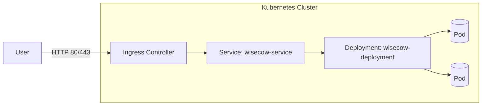

# 🐮 Wisecow — Cow Wisdom Web Server

An ultra-lightweight web service that serves random “wisdom” via `fortune` rendered by `cowsay`. This repo is productionized with Docker, Kubernetes, CI/CD, observability scripts, and an optional zero-trust KubeArmor policy.


<p align="left">
  <a href="https://github.com/${GITHUB_REPOSITORY}/actions">
    
  </a>
  
  
  
</p>

---

## Table of Contents
1. Overview
2. Architecture
3. Quickstart
   - Local
   - Docker
   - Kubernetes (Minikube/Kind)
4. CI/CD
5. TLS via Ingress (optional)
6. Scripts (PS2)
7. KubeArmor Policy (optional bonus)
8. How we built this & key learnings
9. Troubleshooting
10. License

---

## 1) Overview
This repository includes all artifacts to containerize, deploy, automate, and secure the Wisecow app in a modern DevOps workflow.

## 2) Architecture



Key components:
- Deployment with 2 replicas, liveness/readiness probes.
- ClusterIP Service exposed via port-forward or Ingress.
- CI builds/pushes images; optional CD applies manifests.

## 3) Quickstart

### Local prerequisites

```
sudo apt install fortune-mod cowsay -y
```

### Run locally

1. Run `./wisecow.sh`
2. Open `http://localhost:4499`

### Docker

```
docker build -t YOUR_DOCKERHUB/wisecow:latest .
docker run --rm -p 4499:4499 YOUR_DOCKERHUB/wisecow:latest
```

### Kubernetes (Minikube/Kind)

Manifests are in `k8s/`:
- `k8s/deployment.yaml`
- `k8s/service.yaml`
- `k8s/ingress.yaml` (optional TLS)

Deploy:
```
kubectl apply -f k8s/deployment.yaml -f k8s/service.yaml
kubectl port-forward svc/wisecow-service 8080:80
# open http://localhost:8080
```

Ingress + TLS (requires Ingress controller and cert-manager):
```
kubectl apply -f k8s/ingress.yaml
```

## 4) CI/CD (GitHub Actions)

Workflow: `.github/workflows/cicd.yml`

Repository secrets required:
- `DOCKERHUB_USERNAME`
- `DOCKERHUB_TOKEN`
- Optional `KUBECONFIG` (base64 of `kubectl config view --raw`)

On push to `main`, the workflow builds and pushes:
- `DOCKERHUB_USERNAME/wisecow:latest`
- `DOCKERHUB_USERNAME/wisecow:${GITHUB_SHA}`

If `KUBECONFIG` is provided, it deploys manifests and waits for rollout.

## 5) TLS via Ingress (optional)

See `k8s/ingress.yaml` with cert-manager annotations. Configure an Ingress controller and a valid Issuer/ClusterIssuer to automatically provision certificates. For local demos, use `minikube tunnel` and a hosts entry (e.g., `wisecow.local`).

## 6) Scripts (PS2)

- `scripts/health_monitor.sh`: Logs CPU/MEM/DISK and alerts when thresholds are exceeded.
  - Env vars: `CPU_THRESHOLD` (80), `MEM_THRESHOLD` (80), `DISK_THRESHOLD` (90), `LOG_FILE` (/var/log/health_monitor.log)
- `scripts/app_health_check.py`: Checks HTTP status of an app URL (default `http://localhost:4499`).

## 7) KubeArmor Policy (optional bonus)

Apply after installing KubeArmor:
```
kubectl apply -f k8s/kubearmor-policy.yaml
```

## Notes

- Replace `DOCKERHUB_USERNAME` in `k8s/deployment.yaml` or rely on CI replacement step during deploy.
- Service is `ClusterIP`; port-forward or switch to NodePort/LoadBalancer for external access.

---

## 8) How we built this, issues we hit, and how to win the review

### What we implemented
- Containerization: Added a minimal `Dockerfile` on Ubuntu 22.04 installing `fortune-mod` and `cowsay`, launching `wisecow.sh` on port 4499.
- Kubernetes: Created `k8s/deployment.yaml` (2 replicas, liveness/readiness probes), `k8s/service.yaml` (ClusterIP on port 80 → 4499), and `k8s/ingress.yaml` (TLS-ready with cert-manager annotations).
- CI/CD: Workflow `.github/workflows/cicd.yml` builds and pushes images to Docker Hub on every push to `main`. If `KUBECONFIG` is provided (base64), it deploys manifests and waits for rollout.
- Scripts (PS2): `scripts/health_monitor.sh` (CPU/MEM/DISK alerts) and `scripts/app_health_check.py` (HTTP status-based health checker).
- Security (PS3 optional): `k8s/kubearmor-policy.yaml` to block sensitive file reads and audit unexpected binaries.

### Issues encountered and how we resolved them
- Workflow conditional error on job-level `if`: Some runners/YAML parsers can be sensitive to job-level secret checks. We moved the condition to step-level guards using an env variable (`KUBECONFIG_B64`) and `if: ${{ env.KUBECONFIG_B64 != '' }}` for each deploy step.
- kubectl availability in deploy job: Added `azure/setup-kubectl@v4` to install a known version before applying manifests.
- Image tag replacement: To ensure the cluster pulls the newly built image, the deploy step replaces the placeholder `DOCKERHUB_USERNAME/wisecow:latest` with the `${GITHUB_SHA}` tag before `kubectl apply`.
- Local cluster access from CI (optional challenge): If using Minikube/Kind locally, GitHub-hosted runners can't reach it by default. We documented using a cloud cluster or a reachable control plane for automatic deploys; otherwise skip deployment by leaving `KUBECONFIG` unset.
- Windows line endings warning for shell script: Git warned about `CRLF`; scripts still work in containers (Linux) and CI. If needed, set `.gitattributes` for LF.

### How to present (and ace) the assessment
- Keep the repo public, with the following visible:
  - `Dockerfile`, `k8s/` manifests, `.github/workflows/cicd.yml`, `scripts/`, and README.
  - Actions tab showing successful build-and-push runs.
- Configure repo secrets (`DOCKERHUB_USERNAME`, `DOCKERHUB_TOKEN`, optional `KUBECONFIG`). Push to `main` and show:
  - Image built and pushed to `YOUR_DOCKERHUB/wisecow` with both `latest` and commit SHA tags.
  - If `KUBECONFIG` is set to a reachable cluster, show the deploy job applying manifests and a successful rollout.
- Demonstrate the app:
  - Locally: `kubectl port-forward svc/wisecow-service 8080:80` → open `http://localhost:8080`.
  - With Ingress + TLS: show `kubectl get ingress` and a browser to `https://<host>` with a valid certificate (if using cert-manager + a public DNS).
- Show scripts:
  - Run `scripts/app_health_check.py` against the Service/Ingress URL.
  - Run `scripts/health_monitor.sh` and show log output.
- Optional security bonus: Apply `k8s/kubearmor-policy.yaml`, exec into the pod, attempt `cat /etc/shadow`, and show KubeArmor logs blocking/auditing the action with a screenshot committed under `screenshots/`.

## 9) Troubleshooting quick tips
- Deploy doesn’t update image: Ensure the deploy job replaced the image name in `k8s/deployment.yaml` and that the cluster can pull from Docker Hub.
- Ingress not working: Confirm an Ingress controller is installed and DNS/hosts entry points to the LoadBalancer/Node IP. For Minikube, use `minikube tunnel`.
- TLS pending: Install cert-manager and create a matching Issuer/ClusterIssuer; check Certificate and Order resources.
- CI secrets: Verify they are set and not masked by org policies; re-run the workflow on `main`.

## 10) License

This project is licensed under the terms of the LICENSE file included in this repository.
